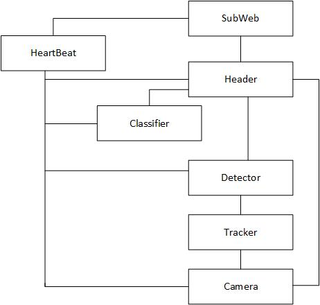
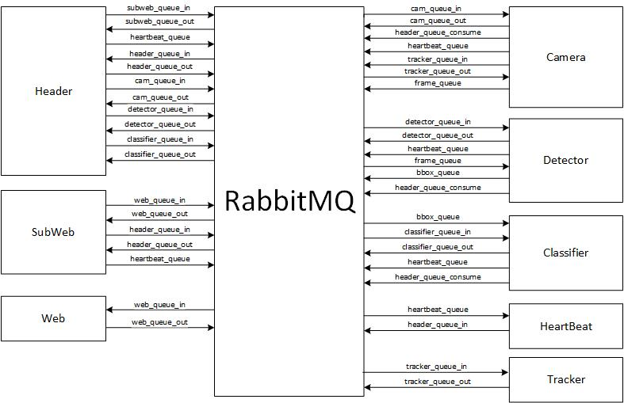
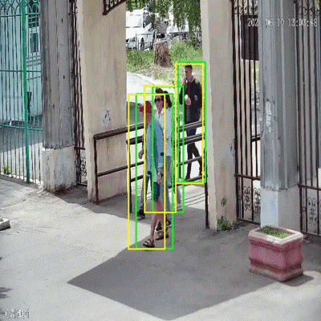
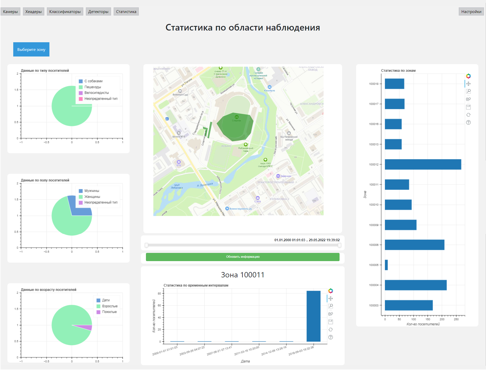
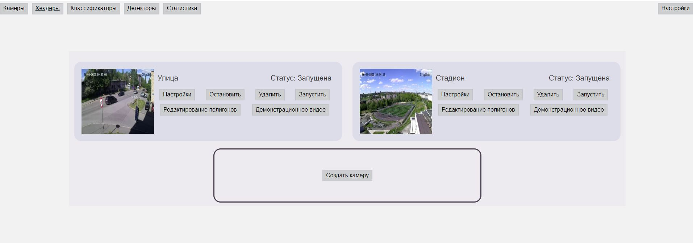
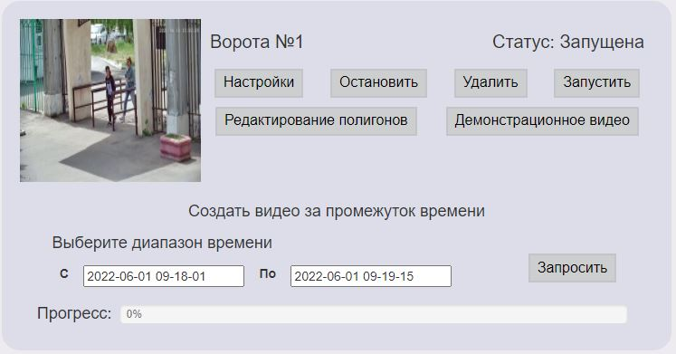

# Анализ потока посетителей общественных пространств по видео

Проект создавался в рамках задачи (https://datamasters.ru/task?id=364) Data-хакатона World AI&Data Challenge и дипломной работы

> Краткое описание задачи: Создать SaaS для оценки количества и атрибутов посетителей парка по загружаемым записям видео с камер наблюдения

> Задачи аналитики:
> * по видео определить, сколько людей входит и выходит через каждую проходную парка;
> * классифицировать людей по признакам: пол, возраст, с коляской, с собакой, велосипед, чтобы лучше понять характеристики потока людей (зависит от качества изображения)
> * построить карту потоков людей в парке, чтобы найти самые популярные и проходные места.
# Сценарий запуска

Для запуска сборки решения из корня проекта необходимо выполнить команду:
```shell
  docker-compose up --build
```

# Описание системы

Решение основано на микросервисной архитектуре. Взаимодействие между микросервисами представлено на картинке:



* `SubWeb`  —  служит для маршрутизации сообщений между сервисами;
* `Header` — производит управление дочерними сервисами. В его функционал входит их запуск, передача информации между сервисами и сервером;
* `Camera` — сервис, реализующий функционал камеры; 
* `Detector` — сервис детектирования;  
* `Classifier` — сервис который производит классификацию объектов на изображениях; 
* `Tracker` — производит отслеживание объектов;
* `HeartBeat` — отслеживает информацию о состоянии каждого сервиса и в случае, если сервис перестает ее посылать, перезапускает его.

Для масштабирования системы необходимо на новой машине запустить микросервис Header, 
он зарегистрируется в системе и позволит запускать на новой машине микросервисы Classifier и Detector.

Взаимодействие между микросервисами осуществляется с помощью брокера сообщений RabbitMQ. 



Для хранения данных использовалась база данных PosgreSQL.

Разработка web интерфейса осуществлялась на Flask.

Для детектирования объектов на изображении  в микросервисе «Detector» применялась нейронная сеть YOLOv5, предварительно обученная на наборе данных COCO.

Для классификации изображения использовалась VGG-19.

Для идентификации объекта на кадре и отслеживания его траектории движения использовался фильтр Калмана.
Он применялся для предсказания следующего месторасположение объекта на основании его истории. 
Рассмотрим подробнее процесс идентификации объекта на изображении. 
На первом шаге происходит инициализация фильтра и для всех полученных Bbox строятся предсказания фильтра, и при получении следующих Bbox 
обнаруженному объекту присваивается идентификатор ближайшего предсказания фильтра с прошлого шага.
На рисунке ниже желтыми Bbox обозначено следующее местоположение каждого объекта.




# Web интерфейс

Главная страница статистики:



Пользователь может просматривать статистику по выбранной зоне, добавлять зоны на карту для быстрого доступа к ним.
А так же производить настройку запрашиваемой статистики.

Страница добавления новых и редактирования созданных камер.



На данной странице пользователь может как добавлять новые камеры в систему, так и редактировать старые. 
Пользователю также доступны расширенные настройки. 
При необходимости пользователь может запросить видеофайл за интересующий период с помощью соответствующего интерфейса:



